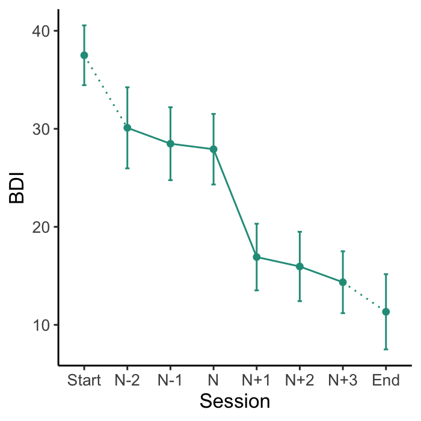

<!-- README.md is generated from README.Rmd. Please edit that file -->

# suddengains

<!-- badges: start -->

[](https://travis-ci.com/milanwiedemann/suddengains)
[](https://ci.appveyor.com/project/milanwiedemann/suddengains-ws7vl)
[](https://choosealicense.com/licenses/gpl-3.0/)
[](https://cran.r-project.org/package=suddengains)
[](https://cran.r-project.org/package=suddengains)
<!-- badges: end -->

Identify sudden gains based on the criteria outlined by Tang and
DeRubeis ([1999](https://doi.org/10.1037/0022-006X.67.6.894)). It
applies all three criteria to a dataset while adjusting for missing
values. It calculates further variables that are of interest. It handles
multiple gains by creating two datasets, one structured by sudden gain
and one by participant. It also implements a function to specify which
sudden gains to choose in case of multiple gains (e.g. the earliest or
largest gain).

To learn more about the background of this package see our preprint on
[PsyArXiv](https://psyarxiv.com/2wa84/). We have also created an open
[Zotero group](https://www.zotero.org/groups/2280342/suddengains)
collecting all the literature looking at sudden gains in psychological
therapies. Please let me know if I missed anything or join the group and
add papers yourself.

## Installation

You can install this development version from [GitHub](https://github.com/) with:

``` r
# install.packages("devtools")
devtools::install_github("milanwiedemann/suddengains", ref = "plos-one-revisions")
```

## Overview of the functions

The `suddengains` package comes with a range of features which can be
categorised into:

1.  Functions to identify sudden gains:

<!-- end list -->

  - `select_cases()`: Select sample providing enough data to identify
    sudden gains
  - `define_crit1_cutoff()`: Uses RCI formula to determine a cut-off
    value for criterion 1
  - `identify_sg()`: Identifies sudden gains
  - `identify_sl()`: Identifies sudden losses
  - `check_interval()`: Checks if a given interval is a sudden gain/loss

<!-- end list -->

2.  Functions to create datasets for further analysis:

<!-- end list -->

  - `extract_values()`: Extracts values on a secondary measure around
    the sudden gain/loss
  - `create_byperson()`: Creates a dataset with one row for each sudden
    gain/loss
  - `create_bysg()`: Creates a dataset with one row for each person

<!-- end list -->

3.  Helper functions to visualise and report sudden gains:

<!-- end list -->

  - `count_intervals()`: Count number of between-session intervals
    available to identify sudden gains
  - `plot_sg()`: Creates plots of the average sudden gain
  - `plot_sg_trajectories()`: Creates plots of plots of individual case
    trajectories
  - `describe_sg()`: Shows descriptives for the sudden gains datasets

<!-- end list -->

4.  Helper functions to export data sets to SPSS, Excel, Stata, and CSV:

<!-- end list -->

  - `write_bysg()`: Exports CSV, SPSS, Excel, or STATA files of the
    sudden gains data sets
  - `write_byperson()`: Exports CSV, SPSS, Excel, or STATA files of the
    sudden gains data sets

A detailed illustration of all functions can be found in the vignette on
[CRAN](https://CRAN.R-project.org/package=suddengains). Note that the
vignette is only available in R when you install the package from CRAN.

## Examples

Below are some examples illustrating the suddengains package. More
details can be found in the
[Vignette](https://CRAN.R-project.org/package=suddengains/vignettes/suddengains-tutorial.html)
or on [PsyArXiv](https://psyarxiv.com/2wa84/).

### 1\. Functions to identify sudden gains

To identify sudden gains/losses you can use the **`identify_sg()`** and
**`identify_sl()`** functions. These functions return a data frame with
new variables indicating for each between-session interval whether a
sudden gain/loss was identified. For example the variable `sg_2to3`
holds information whether a sudden gains occurred from session two to
three, with two being the pregain and three being the postgain session.
Further functions to help with identifying sudden gains are listed
above.

``` r
identify_sg(data = sgdata,
            sg_crit1_cutoff = 7,
            sg_crit2_pct = 0.25,
            sg_crit3 = TRUE,
            id_var_name = "id",
            sg_var_list = c("bdi_s1", "bdi_s2", "bdi_s3", "bdi_s4", 
                            "bdi_s5", "bdi_s6", "bdi_s7", "bdi_s8", 
                            "bdi_s9", "bdi_s10", "bdi_s11", "bdi_s12"),
            identify_sg_1to2 = FALSE)
```

### 2\. Functions to create datasets for further analysis

As participants may experience more than one gain, as in the present
example, and to allow for different subsequent analyses, the package
provides two options for output datasets: The **`create_bysg()`**
function creates a dataset structured with one row per sudden gain, and
the **`create_byperson()`** function creates a dataset structured with
one row per person, indicating whether or not they experienced a sudden
gain. The **`create_bysg()`** function is shown below. More functions to
help with creating datasets for further analyses are listed above.

``` r
# Create output dataset with one row per sudden gain
# and save as an object called "bysg" to use later
bysg <- create_bysg(data = sgdata,
                    sg_crit1_cutoff = 7,
                    id_var_name = "id",
                    tx_start_var_name = "bdi_s1",
                    tx_end_var_name = "bdi_s12",
                    sg_var_list = c("bdi_s1", "bdi_s2", "bdi_s3", "bdi_s4", 
                                    "bdi_s5", "bdi_s6", "bdi_s7", "bdi_s8", 
                                    "bdi_s9", "bdi_s10", "bdi_s11", "bdi_s12"),
                    sg_measure_name = "bdi",
                    identify = "sg")
#> First, second, and third sudden gains criteria were applied.
#> The critical value for the thrid criterion was adjusted for missingness.
```

### 3\. Helper functions to visualise and report sudden gains

The **`plot_sg()`** function plots the ‘average’ sudden gain, and can be
used to show changes around the sudden gain. The
**`plot_sg_trajectories()`** can be used to visualise trajectories for a
selection of individual
cases.

``` r
# Create plot of average change in depression symptoms (BDI) around the gain
plot_sg(data = bysg,
        id_var_name = "id",
        tx_start_var_name = "bdi_s1",
        tx_end_var_name = "bdi_s12",
        sg_pre_post_var_list = c("sg_bdi_2n", "sg_bdi_1n", "sg_bdi_n",
                                 "sg_bdi_n1", "sg_bdi_n2", "sg_bdi_n3"),
        ylab = "BDI", xlab = "Session",
        colour_single = "#239b89ff")
#> Warning: Removed 31 rows containing non-finite values (stat_summary).

#> Warning: Removed 31 rows containing non-finite values (stat_summary).
#> Warning: Removed 16 rows containing non-finite values (stat_summary).
#> Warning: Removed 10 rows containing non-finite values (stat_summary).
#> Warning: Removed 11 rows containing non-finite values (stat_summary).
```


``` r
# Visualise trajectories for a selection of individual cases
plot_sg_trajectories(data = sgdata,
                     id_var = "id",
                     select_id_list = c("2", "4", "5", "9"),
                     var_list = c("bdi_s1", "bdi_s2", "bdi_s3", "bdi_s4", 
                                  "bdi_s5", "bdi_s6", "bdi_s7", "bdi_s8", 
                                  "bdi_s9", "bdi_s10", "bdi_s11", "bdi_s12"),
                     show_id = TRUE,
                     id_label_size = 4,
                     label.padding = .2,
                     show_legend = TRUE,
                     colour = "viridis",
                     viridis_option = "D",
                     viridis_begin = 0,
                     viridis_end = 1,
                     connect_missing = TRUE,
                     scale_x_num = TRUE,
                     scale_x_num_start = 1,
                     apaish = TRUE,
                     xlab = "Session", 
                     ylab = "BDI")
#> Warning: Removed 2 rows containing missing values (geom_point).
#> Warning: Removed 2 rows containing missing values (geom_label_repel).
```



### 4\. Helper functions to export data sets to SPSS, Excel, Stata, and CSV

To continue working in another program (e.g. SPSS, STATA, Excel) the
functions **`write_bysg()`** and **`write_byperson()`** can be used to
export the datasets created in R as *.sav*, *.dta*, *.xlsx*, or *.csv*
files.

``` r
# Here is one example how to create a "bysg" data set and write a CSV file to the computer.
# Note that you have to change the file path and name in the argument 'path'
write_bysg(data = sgdata,
           sg_crit1_cutoff = 7,
           id_var_name = "id",
           tx_start_var_name = "bdi_s1",
           tx_end_var_name = "bdi_s12",
           sg_var_list = c("bdi_s1", "bdi_s2", "bdi_s3", "bdi_s4",
                           "bdi_s5", "bdi_s6", "bdi_s7", "bdi_s8",
                           "bdi_s9", "bdi_s10", "bdi_s11", "bdi_s12"),
           sg_measure_name = "bdi",
           identify = "sg",
           format = "CSV",
           path = "~/Desktop/bysg_data.csv")
```
