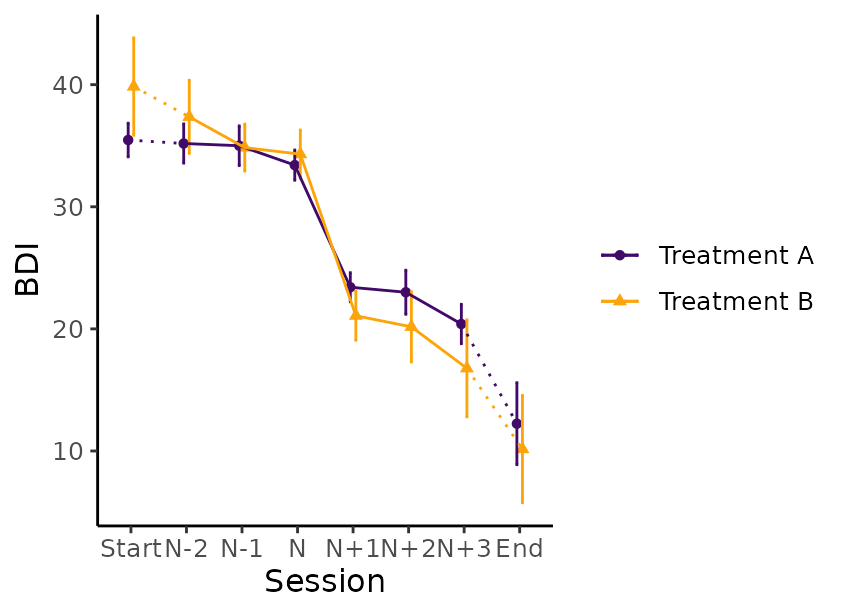

# A tutorial on using the suddengains R package

Please cite this vignette and the R package `suddengains` as:

``` r
citation("suddengains")
#> To cite package 'suddengains' in publications use:
#> 
#>   Wiedemann, M., Thew, G. R., Stott, R., & Ehlers, A. (2020).
#>   suddengains: An R package to identify sudden gains in longitudinal
#>   data. PLOS ONE. https://doi.org/10.1371/journal.pone.0230276
#> 
#> A BibTeX entry for LaTeX users is
#> 
#>   @Article{,
#>     author = {Milan Wiedemann and Graham R Thew and Richard Stott and Anke Ehlers},
#>     title = {{suddengains}: {An} {R} package to identify sudden gains in longitudinal data},
#>     journal = {PLOS ONE},
#>     year = {2020},
#>     doi = {10.1371/journal.pone.0230276},
#>     url = {https://github.com/milanwiedemann/suddengains},
#>   }
```

## Introduction

This vignette shows how the `suddengains` R package can be used to help
with the methods of research studies looking at sudden gains as
described by Tang and DeRubeis ([1999](#ref-Tang1999)). More about the
theoretical background of sudden gains and why it might be helpful to
use this package can be found in our paper Wiedemann et al.
([2020](#ref-R-suddengains)). The following vignette illustrates the
main functions of the package using the example data set `sgdata`.

## Data

Below are two interactive tables of depression and rumination scores
from the data set (`sgdata`) that comes with the `suddengains` package.
The data is automatically loaded together with the package when running
[`library(suddengains)`](https://milanwiedemann.github.io/suddengains/).
Each measured construct contains a baseline measure (**s0**), twelve
weekly measures during therapy (**s1** to **s12**), and two follow-up
measures (**fu1** and **fu2**). Note that some values for each measure
are missing, shown here as empty cells. For an example of a missing
value see **bdi_s2** for **id = 2** in the table below.

### Depression symptoms

### Rumination

## Preparation of data

### Select cases

The package offers two methods to select cases for the calculation of
sudden gains.

1.  `"pattern"`: cases providing enough data to apply the Tang and
    DeRubeis ([1999](#ref-Tang1999)) criteria will be selected
2.  `"min_sess"`: cases with a minimum number of available data points
    (specified in `min_sess_num`) will be selected

By default the argument `return_id_lgl` is set to `FALSE`, which adds a
new variable named `sg_select` at the end of the data frame specified in
the `data` argument. This newly calculated variable `sg_select` is
logical and indicates whether a case is selected (`TRUE`) or not
selected (`FALSE`) based on the method specified. When the argument
`return_id_lgl` is set to `TRUE`, only the id variable specified in
`id_var_name` and the new variable `sg_select` will be returned as the
output of this function.

``` r
# 1. method = "pattern"
select_cases(data = sgdata,
             id_var_name = "id",
             sg_var_list = c("bdi_s1", "bdi_s2", "bdi_s3", "bdi_s4", 
                             "bdi_s5", "bdi_s6", "bdi_s7", "bdi_s8", 
                             "bdi_s9", "bdi_s10", "bdi_s11", "bdi_s12"),
             method = "pattern",
             return_id_lgl = FALSE)

# 2. method = "min_sess"
select_cases(data = sgdata,
             id_var_name = "id",
             sg_var_list = c("bdi_s1", "bdi_s2", "bdi_s3", "bdi_s4", 
                             "bdi_s5", "bdi_s6", "bdi_s7", "bdi_s8", 
                             "bdi_s9", "bdi_s10", "bdi_s11", "bdi_s12"),
             method = "min_sess",
             min_sess_num = 9,
             return_id_lgl = TRUE)
```

The following code shows how to select cases based on the `"pattern"`
method and save them as an object called `sgdata_select`. This function
goes through the data and selects all cases with at least one of the
following data patterns.

| Data pattern | x_(n-2) | x_(n-1) | x_(n) | x_(n+1) | x_(n+2) | x_(n+3) |
|:------------:|---------|---------|-------|---------|---------|---------|
|     1\.      | .       | x       | **x** | x       | x       | .       |
|     2\.      | .       | x       | **x** | x       | .       | x       |
|     3\.      | x       | .       | **x** | x       | x       | .       |
|     4\.      | x       | .       | **x** | x       | .       | x       |

*Note:* x_(n-2) to x_(n+3) are consecutive data points of the primary
outcome measure. “x” = Present data; “.” = Missing data. “**x**”
represents available data to be examined as a possible pregain session.

``` r
sgdata_select <- select_cases(data = sgdata,
                              id_var_name = "id",
                              sg_var_list = c("bdi_s1", "bdi_s2", "bdi_s3", "bdi_s4", 
                                              "bdi_s5", "bdi_s6", "bdi_s7", "bdi_s8", 
                                             "bdi_s9", "bdi_s10", "bdi_s11", "bdi_s12"),
                              method = "pattern",
                              return_id_lgl = FALSE) %>% 
                 dplyr::filter(sg_select == TRUE)
#> The method 'pattern' was used to select cases.
#> See help('select_cases') for more information.
```

## Identification of sudden gains

### Define cut-off for first criterion

This function calculates a cut-off value to use for the first sudden
gains criterion based on the Reliable Change Index (RCI, [Jacobson and
Truax 1991](#ref-Jacobson1991)). The following 5 elements are returned
by the function

- `sd`: Standard deviation manually entered using the `sd` argument or
  the standard deviation of the values specified in `data_sd`
- `reliability`: Reliability of the measure manually specified in
  `reliability` or the internal consistency (Cronbach’s alpha)
  calculated from the item-by-item data specified in `data_reliability`.
- `standard_error_measurement`: Standard error of measurement, see
  formula below:

$$\text{standard\_error\_measurement} = \text{sd} \times \sqrt{1 - \text{reliability}}$$

- `standard_error_difference`: Standard error of the difference between
  two test scores, see formula below:

$$\text{standard\_error\_difference} = \sqrt{2 \times \left( \text{standard\_error\_measurement} \right)^{2}}$$

- `reliable_change_value`: Value that is considered to reflect reliable
  change on a measure ([Jacobson and Truax 1991](#ref-Jacobson1991)).
  This value is calculated using:

$$\text{reliable\_change\_value} = 1.96 \times \text{standard\_error\_difference}$$

The last element of the list `sg_crit1_cutoff` can be used as a cut-off
value for the first sudden gains criterion.

``` r
# Define cut-off value for first SG criterion
# The sd and the reliability are specified manually
define_crit1_cutoff(sd = 10.5,
                    reliability = 0.931)

# The reliability is specified manually
# The sd gets calculated from variable "bdi_s0" in "sgdata" 
define_crit1_cutoff(data_sd = sgdata$bdi_s0,
                    reliability = 0.931)
```

### Identify sudden gains and losses

To identify sudden gains/losses you can use the `identify_sg` and
`identify_sl` functions. These functions return a data frame with new
variables indicating for each between-session interval whether a sudden
gain/loss was identified. For example the variable `sg_2to3` holds
information whether a sudden gains occurred from session two to three,
with two being the pregain and three being the postgain session.

#### Sudden gains

``` r
identify_sg(data = sgdata,
            sg_crit1_cutoff = 7,
            sg_crit2_pct = 0.25,
            sg_crit3 = TRUE,
            id_var_name = "id",
            sg_var_list = c("bdi_s1", "bdi_s2", "bdi_s3", "bdi_s4", 
                            "bdi_s5", "bdi_s6", "bdi_s7", "bdi_s8", 
                            "bdi_s9", "bdi_s10", "bdi_s11", "bdi_s12"),
            identify_sg_1to2 = FALSE)
```

The argument `crit123_details = TRUE` returns additional information
about whether each of the three sudden gains criteria are met. More
information about this can be found in the section “Adaptations to the
original sudden gains criteria” below.

``` r
identify_sg(data = sgdata,
            sg_crit1_cutoff = 7,
            sg_crit2_pct = 0.25,
            sg_crit3 = TRUE,
            id_var_name = "id",
            sg_var_list = c("bdi_s1", "bdi_s2", "bdi_s3", "bdi_s4", 
                            "bdi_s5", "bdi_s6", "bdi_s7", "bdi_s8", 
                            "bdi_s9", "bdi_s10", "bdi_s11", "bdi_s12"),
            identify_sg_1to2 = FALSE,
            crit123_details = TRUE)
```

If we wish to analyse sudden gains that occur immediately after the
first session, we include the option to specify a baseline measure in
`sg_var_list` (in this example `"bdi_s0"`) and set
`identify_sg_1to2 == TRUE`. This will allow the identification of sudden
gains between session 1 and session 2, provided data from the baseline
measure and the first session are available.

``` r
identify_sg(data = sgdata,
            sg_crit1_cutoff = 7,
            sg_crit2_pct = 0.25,
            sg_crit3 = TRUE,
            id_var_name = "id",
            sg_var_list = c("bdi_s0", 
                            "bdi_s1", "bdi_s2", "bdi_s3", "bdi_s4", 
                            "bdi_s5", "bdi_s6", "bdi_s7", "bdi_s8", 
                            "bdi_s9", "bdi_s10", "bdi_s11", "bdi_s12"),
            identify_sg_1to2 = TRUE)
```

#### Sudden losses

To identify sudden losses, you can use the `identify_sl` function. All
arguments are the same as in the `identify_sg` function, but the
`sg_crit1_cutoff` must be set to be a negative value.

``` r
identify_sl(data = sgdata,
            sg_crit1_cutoff = -7,
            sg_crit2_pct = 0.25,
            sg_crit3 = TRUE,
            id_var_name = "id",
            sg_var_list = c("bdi_s1", "bdi_s2", "bdi_s3", "bdi_s4", 
                            "bdi_s5", "bdi_s6", "bdi_s7", "bdi_s8", 
                            "bdi_s9", "bdi_s10", "bdi_s11", "bdi_s12"),
            identify_sg_1to2 = FALSE)
```

#### Adaptations to the original sudden gains criteria

The package includes options for modifying or omitting the three
original sudden gains criteria suggested by Tang and DeRubeis
([1999](#ref-Tang1999)):

1.  The cut-off value for clinically meaningful change on the measure
    used to identify sudden gains is specified using the argument
    `sg_crit1_cutoff`. To omit the first criterion when identifying
    sudden gains, this argument can be ‘switched off’ by using
    `sg_crit1_cutoff = NULL`.
2.  The minimum percentage drop from the pre- to post-gain session is
    specified using the argument `sg_crit2_pct`. The default is a
    minimum of a 25% drop, i.e. `sg_crit2_pct = 0.25`. To omit the
    second criterion when identifying sudden gains, this argument can be
    ‘switched off’ by using `sg_crit2_pct = NULL`.
3.  The third criterion can be ‘switched off’ using `sg_crit3 = FALSE`.
    It is also possible to change the significance level ($\alpha$) used
    to determine the critical value based on the student t distribution,
    by default `sg_crit3_alpha = 0.05`.

``` r
# This example only uses the first and second sudden gains criteria 
# All following examples work the same for the "identify_sl()" function
# The argument "crit123_details = TRUE" returns details about each between session interval for each criterion.
# Details about the third criterion will show NAs for each between session interval because it's not being used (sg_crit3 = FALSE)
identify_sg(data = sgdata,
            sg_crit1_cutoff = 7,
            sg_crit2_pct = 0.25,
            sg_crit3 = FALSE,
            id_var_name = "id",
            sg_var_list = c("bdi_s1", "bdi_s2", "bdi_s3", "bdi_s4", 
                            "bdi_s5", "bdi_s6", "bdi_s7", "bdi_s8", 
                            "bdi_s9", "bdi_s10", "bdi_s11", "bdi_s12"),
            identify_sg_1to2 = FALSE,
            crit123_details = TRUE)

# This example only uses the first, second, and a modified third sudden gains criterion (sg_crit3_alpha = 0.01)
identify_sg(data = sgdata,
            sg_crit1_cutoff = 7,
            sg_crit2_pct = 0.25,
            sg_crit3 = TRUE,
            sg_crit3_alpha = 0.01,
            id_var_name = "id",
            sg_var_list = c("bdi_s1", "bdi_s2", "bdi_s3", "bdi_s4", 
                            "bdi_s5", "bdi_s6", "bdi_s7", "bdi_s8", 
                            "bdi_s9", "bdi_s10", "bdi_s11", "bdi_s12"),
            identify_sg_1to2 = FALSE,
            crit123_details = TRUE)

# This example only uses the first criterion and a modified second criterion (50%) 
identify_sg(data = sgdata,
            sg_crit1_cutoff = 7,
            sg_crit2_pct = 0.50,
            sg_crit3 = FALSE,
            id_var_name = "id",
            sg_var_list = c("bdi_s1", "bdi_s2", "bdi_s3", "bdi_s4", 
                            "bdi_s5", "bdi_s6", "bdi_s7", "bdi_s8", 
                            "bdi_s9", "bdi_s10", "bdi_s11", "bdi_s12"),
            identify_sg_1to2 = FALSE,
            crit123_details = TRUE)

# This example only uses the first criterion
# Details about the second and third criterion will show NAs for each between session interval
identify_sg(data = sgdata,
            sg_crit1_cutoff = 7,
            sg_crit2_pct = NULL,
            sg_crit3 = FALSE,
            id_var_name = "id",
            sg_var_list = c("bdi_s1", "bdi_s2", "bdi_s3", "bdi_s4", 
                            "bdi_s5", "bdi_s6", "bdi_s7", "bdi_s8", 
                            "bdi_s9", "bdi_s10", "bdi_s11", "bdi_s12"),
            identify_sg_1to2 = FALSE,
            crit123_details = TRUE)

# This example only uses the first criterion
# Details about the second and third criterion will show NAs for each between session interval
identify_sg(data = sgdata,
            sg_crit1_cutoff = 7,
            sg_crit2_pct = NULL,
            sg_crit3 = FALSE,
            id_var_name = "id",
            sg_var_list = c("bdi_s1", "bdi_s2", "bdi_s3", "bdi_s4", 
                            "bdi_s5", "bdi_s6", "bdi_s7", "bdi_s8", 
                            "bdi_s9", "bdi_s10", "bdi_s11", "bdi_s12"),
            identify_sg_1to2 = FALSE,
            crit123_details = TRUE)
```

#### Check a specific intervals for a sudden gain/loss

The function
**[`check_interval()`](https://milanwiedemann.github.io/suddengains/reference/check_interval.md)**
can be used to examine whether a specific between-session interval is a
sudden gain/loss.

``` r
# Check interval for sudden gain using all 3 criteria
# No missing data, alpha = 0.05
check_interval(pre_values = c(32, 31, 33),
               post_values = c(5, 6, 7),
               sg_crit1_cutoff = 7,
               sg_crit2_pct = .25,
               sg_crit3 = TRUE,
               sg_crit3_alpha = .05,
               identify = "sg")
#> First, second, and third sudden gains criteria were applied.
#> The critical value for the thrid criterion was adjusted for missingness.
#> # Check sudden gain
#> ## Met Criterion 1: YES
#> ## Met Criterion 2: YES
#> ## Met Criterion 3: YES
#> ## Sudden gain: YES
#> 
#> # Detailed output
#> ## Criterion 1: Cut-off: 7 
#> ## Criterion 2: Percentage change threshhold: 25 %
#> ## Criterion 3: Adjusted: YES, Critical value: 2.776
#> ## Number of pre gain values present: 3
#> ## Number of post gain values present: 3
#> ## Mean of pre gain values: 32
#> ## Mean of post gain values: 6
#> ## SD of pre gain values: 1
#> ## SD of post gain values: 1

# Check interval for sudden gain using all 3 criteria
# No missing data, alpha = 0.01
check_interval(pre_values = c(32, 31, 33),
               post_values = c(5, 6, 7),
               sg_crit1_cutoff = 7,
               sg_crit2_pct = .25,
               sg_crit3 = TRUE,
               sg_crit3_alpha = .01,
               identify = "sg")
#> First, second, and third sudden gains criteria were applied.
#> The critical value for the thrid criterion was adjusted for missingness.
#> # Check sudden gain
#> ## Met Criterion 1: YES
#> ## Met Criterion 2: YES
#> ## Met Criterion 3: YES
#> ## Sudden gain: YES
#> 
#> # Detailed output
#> ## Criterion 1: Cut-off: 7 
#> ## Criterion 2: Percentage change threshhold: 25 %
#> ## Criterion 3: Adjusted: YES, Critical value: 4.604
#> ## Number of pre gain values present: 3
#> ## Number of post gain values present: 3
#> ## Mean of pre gain values: 32
#> ## Mean of post gain values: 6
#> ## SD of pre gain values: 1
#> ## SD of post gain values: 1

# Check intervall for sudden gain using only third criterion
# Some missing data, alpha = 0.01
check_interval(pre_values = c(NA, 31, 33),
               post_values = c(5, NA, 7),
               sg_crit1_cutoff = NULL,
               sg_crit2_pct = NULL,
               sg_crit3 = TRUE,
               sg_crit3_alpha = .01,
               identify = "sg")
#> Third sudden gains criterion was applied.
#> The critical value for the thrid criterion was adjusted for missingness.
#> # Check sudden gain
#> ## Met Criterion 1: NA
#> ## Met Criterion 2: NA
#> ## Met Criterion 3: YES
#> ## Sudden gain: YES
#> 
#> # Detailed output
#> ## Criterion 1: Cut-off: Criterion 1 was not applied
#> ## Criterion 2: Percentage change threshhold: Criterion 2 was not applied
#> ## Criterion 3: Adjusted: YES, Critical value: 9.925
#> ## Number of pre gain values present: 2
#> ## Number of post gain values present: 2
#> ## Mean of pre gain values: 32
#> ## Mean of post gain values: 6
#> ## SD of pre gain values: 1.414
#> ## SD of post gain values: 1.414

# Check intervall for sudden loss using all three criteria
# Some missing data, alpha = 0.05
check_interval(pre_values = c(5, NA, 7),
               post_values = c(16, 12, 14),
               sg_crit1_cutoff = -7,
               sg_crit2_pct = .25,
               sg_crit3 = TRUE,
               sg_crit3_alpha = .05,
               identify = "sl")
#> First, second, and third sudden gains criteria were applied.
#> The critical value for the thrid criterion was adjusted for missingness.
#> # Check sudden loss
#> ## Met Criterion 1: YES
#> ## Met Criterion 2: YES
#> ## Met Criterion 3: YES
#> ## Sudden loss: YES
#> 
#> # Detailed output
#> ## Criterion 1: Cut-off: -7 
#> ## Criterion 2: Percentage change threshhold: 25 %
#> ## Criterion 3: Adjusted: YES, Critical value: 3.182
#> ## Number of pre gain values present: 2
#> ## Number of post gain values present: 3
#> ## Mean of pre gain values: 6
#> ## Mean of post gain values: 14
#> ## SD of pre gain values: 1.414
#> ## SD of post gain values: 2
```

## Create datasets for further analysis

### All gains: One row per gain

In the `suddengains` R package we refer to this as “bysg” (by sudden
gain).

Here we see code to create a “bysg” data set identifying sudden gains
(specified using the argument `identify = "sg"`) and save it to the
object called “bysg”. The table below shows the output including the
following 15 new variables:

- `id_sg`: Unique identifier for each sudden gain
- `sg_crit123`: Logical variable indicating whether a sudden gain was
  identified
- `sg_session_n`: Pregain session number
- `sg_freq_byperson`: Frequency of sudden gains identified for each case
  (`id`)
- `sg_bdi_2n`, `sg_bdi_1n`, `sg_bdi_n`, `sg_bdi_n1`, `sg_bdi_n2`,
  `sg_bdi_n3`: Six extracted values of the sudden gains measure around
  the sudden gain
- `sg_magnitude`: Magnitude of the sudden gain for each case
- `sg_**bdi**_tx_change`: Total change on the sudden gains measure from
  start (`tx_start_var_name`) to end (`tx_end_var_name`) for each case
- `sg_change_proportion`: Magnitude of the sudden gain (`sg_magnitude`)
  divided by the total change `sg_bdi_tx_change`
- `sg_reversal_value`: Value representing the threshold for the sudden
  gain to be considered ‘reversed’
- `sg_reversal`: Logical variable indicating whether a sudden gain
  reversed

``` r
bysg <- create_bysg(data = sgdata,
                    sg_crit1_cutoff = 7,
                    id_var_name = "id",
                    tx_start_var_name = "bdi_s1",
                    tx_end_var_name = "bdi_s12",
                    sg_var_list = c("bdi_s1", "bdi_s2", "bdi_s3", "bdi_s4", 
                                    "bdi_s5", "bdi_s6", "bdi_s7", "bdi_s8", 
                                    "bdi_s9", "bdi_s10", "bdi_s11", "bdi_s12"),
                    sg_measure_name = "bdi",
                    identify = "sg")
#> First, second, and third sudden gains criteria were applied.
#> The critical value for the third criterion was adjusted for missingness.
```

Here we see code to create a “bysg” data set identifying sudden losses
(specified using the argument `identify = "sl"`) and save it to the
object called “bysl”. The following table shows the output.

``` r
bysl <- create_bysg(data = sgdata,
                    sg_crit1_cutoff = -7,
                    id_var_name = "id",
                    tx_start_var_name = "bdi_s1",
                    tx_end_var_name = "bdi_s12",
                    sg_var_list = c("bdi_s1", "bdi_s2", "bdi_s3", "bdi_s4", 
                                    "bdi_s5", "bdi_s6", "bdi_s7", "bdi_s8", 
                                    "bdi_s9", "bdi_s10", "bdi_s11", "bdi_s12"),
                    sg_measure_name = "bdi",
                    identify = "sl")
#> First, second, and third sudden gains criteria were applied.
#> The critical value for the third criterion was adjusted for missingness.
```

### All cases: One row per case

In the `suddengains` R package we refer to this as byperson (by person).
This data set includes all cases with and all cases without sudden
gains. If multiple sudden gains were experienced by a case, the argument
`multiple_sg_select` is used to specify which gain should be selected;
in the example below the first gain will be selected.

``` r
byperson_first <- create_byperson(data = sgdata,
                                  sg_crit1_cutoff = 7,
                                  id_var_name = "id",
                                  tx_start_var_name = "bdi_s1",
                                  tx_end_var_name = "bdi_s12",
                                  sg_var_list = c("bdi_s1", "bdi_s2", "bdi_s3", "bdi_s4", 
                                                  "bdi_s5", "bdi_s6", "bdi_s7", "bdi_s8", 
                                                  "bdi_s9", "bdi_s10", "bdi_s11", "bdi_s12"),
                                  sg_measure_name = "bdi",
                                  identify_sg_1to2 = FALSE,
                                  multiple_sg_select = "first")
#> First, second, and third sudden gains criteria were applied.
#> The critical value for the third criterion was adjusted for missingness.
#> The first gain/loss was selected in case of multiple gains/losses.
```

Depending on the research question it might be of interest to select the
largest gain, as shown below. Notice that the selected gain for ID 5 is
different depending on how multiple gains are handled. The first gain
experienced by ID 5 is from session 3 to 4, whereas the largest gain was
experienced from session 8 to 9.

``` r
byperson_largest <- create_byperson(data = sgdata,
                                    sg_crit1_cutoff = 7,
                                    id_var_name = "id",
                                    tx_start_var_name = "bdi_s1",
                                    tx_end_var_name = "bdi_s12",
                                    sg_var_list = c("bdi_s1", "bdi_s2", "bdi_s3", "bdi_s4", 
                                                    "bdi_s5", "bdi_s6", "bdi_s7", "bdi_s8", 
                                                    "bdi_s9", "bdi_s10", "bdi_s11", "bdi_s12"),
                                    sg_measure_name = "bdi",
                                    identify_sg_1to2 = FALSE,
                                    multiple_sg_select = "largest")
#> First, second, and third sudden gains criteria were applied.
#> The critical value for the third criterion was adjusted for missingness.
#> The largest gain/loss was selected in case of multiple gains/losses.
```

## Extract values around sudden gains

The package can extract scores on secondary outcome or process measures
around the period of each gain. This function can be applied to either
the bysg or byperson dataset. Note that the variables specified in
`extract_var_list` must be in the data set specified in `data`.

``` r
# For bysg dataset select "id" and "rq" variables first
sgdata_rq <- sgdata %>% 
    dplyr::select(id, rq_s0:rq_s12)

# Join them with the sudden gains data set, here "bysg"
bysg_rq <- bysg %>%
    dplyr::left_join(sgdata_rq, by = "id")

# Extract "rq" scores around sudden gains on "bdi" in the bysg dataset
bysg_rq <- extract_values(data = bysg_rq,
                          id_var_name = "id_sg",
                          extract_var_list = c("rq_s1", "rq_s2", "rq_s3", "rq_s4", 
                                               "rq_s5", "rq_s6", "rq_s7", "rq_s8", 
                                               "rq_s9", "rq_s10", "rq_s11", "rq_s12"),
                          extract_measure_name = "rq",
                          add_to_data = TRUE)
#> Note: The measure specified in 'extract_var_list' must have the same number of repeated time points as the measure used to identify sudden gains.
```

## Plots of average change around sudden gains

These plots are created using the *ggplot2* R-package ([Wickham
2016](#ref-R-ggplot2)) in five main steps:

1.  Means for all time points and points
2.  95% confidence intervals for all time points
3.  Dotted line between the first two values
4.  Straight line between all 5 values around the gain
5.  Dotted line between the last two values

``` r
# Create plot of average change in depression symptoms (BDI) around the gain
plot_sg_bdi <- plot_sg(data = bysg,
                       id_var_name = "id",
                       tx_start_var_name = "bdi_s1",
                       tx_end_var_name = "bdi_s12",
                       sg_pre_post_var_list = c("sg_bdi_2n", "sg_bdi_1n", "sg_bdi_n",
                                                "sg_bdi_n1", "sg_bdi_n2", "sg_bdi_n3"),
                       ylab = "BDI", xlab = "Session",
                       colour_single = "#239b89ff")

# Create plot of average change in rumination (RQ) around depression sudden gains
plot_sg_rq <- plot_sg(data = bysg_rq,
                      id_var_name = "id",
                      tx_start_var_name = "rq_s1",
                      tx_end_var_name = "rq_s12",
                      sg_pre_post_var_list = c("sg_rq_2n", "sg_rq_1n", "sg_rq_n",
                                               "sg_rq_n1", "sg_rq_n2", "sg_rq_n3"),
                      ylab = "RQ", xlab = "Session",
                      colour_single = "#440154FF") 


# It is then possible to apply other ggplot2 functions to the plot if desired,
# e.g. y axis scale, or x axis labels ...

plot_sg_bdi <- plot_sg_bdi + 
               ggplot2::coord_cartesian(ylim = c(0, 50))

plot_sg_rq <- plot_sg_rq + 
              ggplot2::scale_x_discrete(labels = c("First", "n-2", "n-1", "n",
                                                   "n+1", "n+2", "n+3", "Last"))
#> Scale for x is already present.
#> Adding another scale for x, which will replace the existing scale.
```

Each plot will automatically return a warning message about how many
missing values were present for each of the five components mentioned
above. The warning messages from the BDI plot can be interpreted as
follows:

1.  *Means for all time points and points*: There are **12 missing
    values** overall
2.  *95% confidence intervals for all time points:* There are **12
    missing values** overall
3.  *Dotted line between the first two values:* There are **8 missing
    values** at session `tx_start_var_name` and the *first* variable
    specified in `sg_pre_post_var_list` together
4.  *Straight line between all 5 values around the gain:* There are **11
    missing values** together in all variables specified in
    `sg_pre_post_var_list`
5.  *Dotted line between the last two values:* There is **1 missing
    values** at session `tx_end_var_name` and the *last* variable
    specified in `sg_pre_post_var_list`

``` r
plot_sg_bdi
#> Warning: Removed 27 rows containing non-finite outside the scale range
#> (`stat_summary()`).
#> Removed 27 rows containing non-finite outside the scale range
#> (`stat_summary()`).
#> Warning: Removed 14 rows containing non-finite outside the scale range
#> (`stat_summary()`).
#> Warning: Removed 8 rows containing non-finite outside the scale range
#> (`stat_summary()`).
#> Warning: Removed 10 rows containing non-finite outside the scale range
#> (`stat_summary()`).
plot_sg_rq 
#> Warning: Removed 30 rows containing non-finite outside the scale range
#> (`stat_summary()`).
#> Warning: Removed 30 rows containing non-finite outside the scale range
#> (`stat_summary()`).
#> Warning: Removed 14 rows containing non-finite outside the scale range
#> (`stat_summary()`).
#> Warning: Removed 10 rows containing non-finite outside the scale range
#> (`stat_summary()`).
#> Warning: Removed 12 rows containing non-finite outside the scale range
#> (`stat_summary()`).
```


### Plot average gain for multiple groups

To illustrate this functionality we create a data frame with a grouping
variable. The code below duplicates the data frame `sgdata` and adds a
variable assigning each case to one of two groups.

``` r
# Set seed
set.seed(123)

# Duplicate data
sgdata_group <- rbind(sgdata, sgdata)

# Overwrite id variable
sgdata_group$id <- c(1:86)

# Add random group variable
sgdata_group$group <- sample(seq(from = 1, to = 2, by = 1), size = 86, replace = TRUE)

# Create byperson data set
byperson_group <- create_byperson(data = sgdata_group,
                                  sg_crit1_cutoff = 7,
                                  id_var_name = "id",
                                  tx_start_var_name = "bdi_s1",
                                  tx_end_var_name = "bdi_s12",
                                  sg_var_list = c("bdi_s1", "bdi_s2", "bdi_s3",
                                                  "bdi_s4", "bdi_s5", "bdi_s6",
                                                  "bdi_s7", "bdi_s8", "bdi_s9",
                                                  "bdi_s10", "bdi_s11", "bdi_s12"),
                                  sg_measure_name = "bdi",
                                  multiple_sg_select = "first")
#> First, second, and third sudden gains criteria were applied.
#> The critical value for the third criterion was adjusted for missingness.
#> The first gain/loss was selected in case of multiple gains/losses.

byperson_group_select <- select_cases(data = byperson_group,
                              id_var_name = "id",
                              sg_var_list = c("bdi_s1", "bdi_s2", "bdi_s3", "bdi_s4", 
                                              "bdi_s5", "bdi_s6", "bdi_s7", "bdi_s8", 
                                             "bdi_s9", "bdi_s10", "bdi_s11", "bdi_s12"),
                              method = "pattern",
                              return_id_lgl = FALSE) %>% 
                 dplyr::filter(sg_select == TRUE)
#> The method 'pattern' was used to select cases.
#> See help('select_cases') for more information.
```

The data frame `sgdata_group` can now be used to illustrate the plotting
function for different groups. This function works identically to the
plot function for a single group. Further arguments are used to specify
the colours to be used for the different groups.

``` r
plot_byperson_group <- plot_sg(data = byperson_group_select,
                               id_var_name = "id",
                               tx_start_var_name = "bdi_s1",
                               tx_end_var_name = "bdi_s12",
                               sg_pre_post_var_list = c("sg_bdi_2n", "sg_bdi_1n", "sg_bdi_n",
                                                        "sg_bdi_n1", "sg_bdi_n2", "sg_bdi_n3"),
                               group_var_name = "group",
                               group_levels = c(1, 2),
                               group_labels = c("Treatment A", "Treatment B"),
                               group_title = NULL,
                               colour_group = "viridis",
                               viridis_option = "B",
                               viridis_begin = 0.2,
                               viridis_end = 0.8,
                               apaish = TRUE,
                               ylab = "BDI", xlab = "Session")
```

The plot below shows the average gain for each group.

``` r
plot_byperson_group
#> Warning: Removed 402 rows containing non-finite outside the scale range
#> (`stat_summary()`).
#> Removed 402 rows containing non-finite outside the scale range
#> (`stat_summary()`).
#> Warning: Removed 106 rows containing non-finite outside the scale range
#> (`stat_summary()`).
#> Warning: Removed 304 rows containing non-finite outside the scale range
#> (`stat_summary()`).
#> Warning: Removed 98 rows containing non-finite outside the scale range
#> (`stat_summary()`).
```



### Plot individual trajectories

The function
[`plot_sg_trajectories()`](https://milanwiedemann.github.io/suddengains/reference/plot_sg_trajectories.md)
can plot individual trajectories of the cases in the data set. It is
possible to select specific IDs for plotting using the `select_id_list`
argument, or a number of random IDs using the `sample_n` argument.
Below, case IDs 2, 4, 5 and 9 are selected.

``` r
plot_trajectories_1 <- sgdata %>%
    plot_sg_trajectories(id_var = "id",
                         select_id_list = c("2", "4", "5", "9"),
                         var_list = c("bdi_s1", "bdi_s2", "bdi_s3", "bdi_s4", 
                                      "bdi_s5", "bdi_s6", "bdi_s7", "bdi_s8", 
                                      "bdi_s9", "bdi_s10", "bdi_s11", "bdi_s12"),
                         show_id = TRUE,
                         id_label_size = 4,
                         label.padding = 0.2,
                         show_legend = FALSE,
                         colour = "viridis",
                         viridis_option = "D",
                         viridis_begin = 0,
                         viridis_end = 0.8,
                         connect_missing = FALSE,
                         scale_x_num = TRUE,
                         scale_x_num_start = 1,
                         apaish = TRUE,
                         xlab = "Session", 
                         ylab = "BDI")
```

``` r
plot_trajectories_1
#> Warning: Removed 3 rows containing missing values or values outside the scale range
#> (`geom_point()`).
#> Warning: Removed 3 rows containing missing values or values outside the scale range
#> (`geom_label_repel()`).
```


This function can also be combined with a filter function to explore
specific groups of sudden gains cases, for example (1) all cases with a
sudden gain at session 3, or (2) three randomly selected
(`select_n = 3`) cases who experienced more than one sudden gain
(`dplyr::filter(sg_freq_byperson > 1`).

``` r
# 1. Create plot including all cases with a sudden gain at session 3
plot_trajectories_2 <- bysg %>%
    dplyr::filter(sg_session_n == 3) %>% 
    plot_sg_trajectories(id_var = "id_sg",
                         var_list = c("bdi_s1", "bdi_s2", "bdi_s3", "bdi_s4", 
                                      "bdi_s5", "bdi_s6", "bdi_s7", "bdi_s8", 
                                      "bdi_s9", "bdi_s10", "bdi_s11", "bdi_s12"),
                         show_id = FALSE,
                         id_label_size = 4,
                         label.padding = 0.2,
                         show_legend = TRUE,
                         colour = "viridis",
                         viridis_option = "D",
                         viridis_begin = 0,
                         viridis_end = 0.8,
                         connect_missing = TRUE,
                         scale_x_num = TRUE,
                         scale_x_num_start = 1,
                         apaish = TRUE,
                         xlab = "Session", 
                         ylab = "BDI")
```

``` r
# 1. Show all cases with a sudden gain at session 3
plot_trajectories_2
#> Warning: Removed 4 rows containing missing values or values outside the scale range
#> (`geom_point()`).
```


``` r
# 2. Create plot including 3 randomly selected (select_n = 3) cases who experienced 
#    more than 1 gain (dplyr::filter(sg_freq_byperson > 1))
plot_trajectories_3 <- byperson_first %>%
    dplyr::filter(sg_freq_byperson > 1) %>% 
    plot_sg_trajectories(id_var = "id_sg",
                         var_list = c("bdi_s1", "bdi_s2", "bdi_s3", "bdi_s4", 
                                      "bdi_s5", "bdi_s6", "bdi_s7", "bdi_s8", 
                                      "bdi_s9", "bdi_s10", "bdi_s11", "bdi_s12"),
                         select_n = 3,
                         show_id = FALSE,
                         id_label_size = 4,
                         label.padding = 0.2,
                         show_legend = TRUE,
                         colour = "viridis",
                         viridis_option = "D",
                         viridis_begin = 0,
                         viridis_end = 0.8,
                         connect_missing = TRUE,
                         scale_x_num = TRUE,
                         scale_x_num_start = 1,
                         apaish = TRUE,
                         xlab = "Session", 
                         ylab = "BDI")
```

``` r
# 2. Show 3 cases (select_n = 3) with more than 1 gain (dplyr::filter(sg_freq_byperson > 1))
plot_trajectories_3
```


## Summarise descriptive statistics

### Count between-session intervals

The `count_intervals` function provides a summary of how many
between-session intervals were and were not analysed for sudden gains.
For more information see the help file for this function,
[`help(count_intervals)`](https://milanwiedemann.github.io/suddengains/reference/count_intervals.md).
Here we see code to count only the intervals of the data that was
selected for the sudden gains study in the above code using
`sgdata_select`.

- `total_between_sess_intervals`: The total number of between-session
  intervals present in the data set, here: `sgdata_select`.
- `total_between_sess_intervals_sg`: The total number of gain intervals
  (i.e. sudden gains) present in the data set. By default the
  first-to-second and penultimate-to-last intervals are not included
  here. If `identify_sg_1to2` is set to `TRUE` the first-to-second
  intervals will be included.
- `available_between_sess_intervals_sg`: The total number of
  between-session intervals that could feasibly be analysed for sudden
  gains.
- `not_available_between_sess_intervals_sg`: The total number of
  between-session intervals that could not be analysed for sudden gains
  (due to missing data).

``` r
count_intervals(data = sgdata_select,
                id_var_name = "id",
                sg_var_list = c("bdi_s1", "bdi_s2", "bdi_s3", "bdi_s4",
                                "bdi_s5", "bdi_s6", "bdi_s7", "bdi_s8",
                                "bdi_s9", "bdi_s10", "bdi_s11", "bdi_s12"),
                identify_sg_1to2 = FALSE)
#> $total_between_sess_intervals
#> [1] 429
#> 
#> $total_between_sess_intervals_sg
#> [1] 351
#> 
#> $available_between_sess_intervals_sg
#> [1] 298
#> 
#> $not_available_between_sess_intervals_sg
#> [1] 53
```

The
[`plot_sg_intervals()`](https://milanwiedemann.github.io/suddengains/reference/plot_sg_intervals.md)
can be used to visualise the available data for each time point as well
as the percentage of session to session intervals that are analysed for
potential sudden gains.

``` r
plot_sg_intervals(data = sgdata_select,
                  id_var_name = "id",
                  sg_var_list = c("bdi_s1", "bdi_s2", "bdi_s3", "bdi_s4",
                                  "bdi_s5", "bdi_s6", "bdi_s7", "bdi_s8",
                                  "bdi_s9", "bdi_s10", "bdi_s11", "bdi_s12"))
```


### Descriptive statistics of sudden gains

The
[`describe_sg()`](https://milanwiedemann.github.io/suddengains/reference/describe_sg.md)
function provides descriptive statistics about the sudden gains based on
the variables from the `bysg` or `byperson` datasets. The descriptives
(e.g. “sg_pct”, the percentage of cases with sudden gains in the
specified data set) are always in relation to the input data and
therefore will vary depending on whether the structure of the data set
is `bysg` or `byperson`.

``` r
# Describe bysg dataset ----
describe_sg(data = bysg, 
            sg_data_structure = "bysg")
#> $total_n
#> [1] 24
#> 
#> $sg_total_n
#> [1] 24
#> 
#> $sg_pct
#> [1] 100
#> 
#> $sg_multiple_pct
#> [1] 70.83
#> 
#> $sg_reversal_n
#> [1] 4
#> 
#> $sg_reversal_pct
#> [1] 16.67
#> 
#> $sg_magnitude_m
#> [1] 11
#> 
#> $sg_magnitude_sd
#> [1] 3.43

# Describe byperson dataset ----
describe_sg(data = byperson_first, 
            sg_data_structure = "byperson")
#> $total_n
#> [1] 43
#> 
#> $sg_total_n
#> [1] 24
#> 
#> $sg_n
#> [1] 15
#> 
#> $sg_pct
#> [1] 34.88
#> 
#> $sg_multiple_n
#> [1] 8
#> 
#> $sg_multiple_pct
#> [1] 18.6
#> 
#> $sg_reversal_n
#> [1] 3
#> 
#> $sg_reversal_pct
#> [1] 20
#> 
#> $sg_magnitude_m
#> [1] 11.4
#> 
#> $sg_magnitude_sd
#> [1] 3.98
```

## References

Jacobson, Neil S, and Paula A Truax. 1991. “Clinical Significance: A
Statistical Approach to Defining Meaningful Change in Psychotherapy
Research.” *Journal of Consulting and Clinical Psychology* 59 (1):
12–19. <https://doi.org/10.1037/0022-006X.59.1.12>.

Tang, Tony Z, and Robert J DeRubeis. 1999. “Sudden Gains and Critical
Sessions in Cognitive-Behavioral Therapy for Depression.” *Journal of
Consulting and Clinical Psychology* 67 (6): 894–904.
<https://doi.org/10.1037/0022-006X.67.6.894>.

Wickham, Hadley. 2016. *ggplot2: Elegant Graphics for Data Analysis*.
Springer-Verlag New York. <https://ggplot2.tidyverse.org>.

Wiedemann, Milan, Graham R Thew, Richard Stott, and Anke Ehlers. 2020.
“suddengains: An R Package to Identify Sudden Gains in Longitudinal
Data.” *PLOS ONE*. <https://doi.org/10.1371/journal.pone.0230276>.
