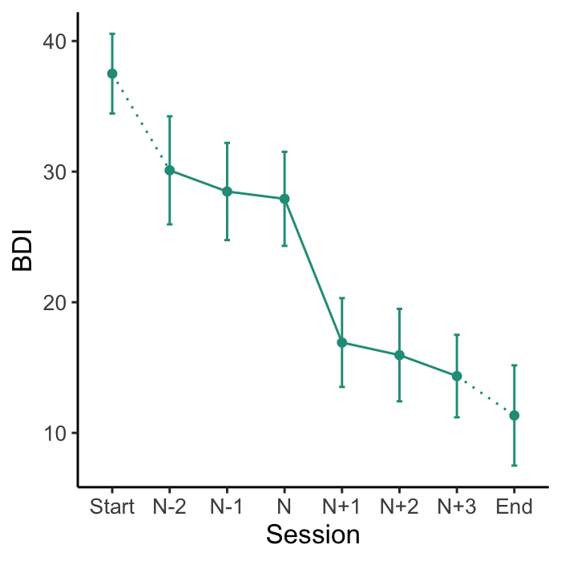
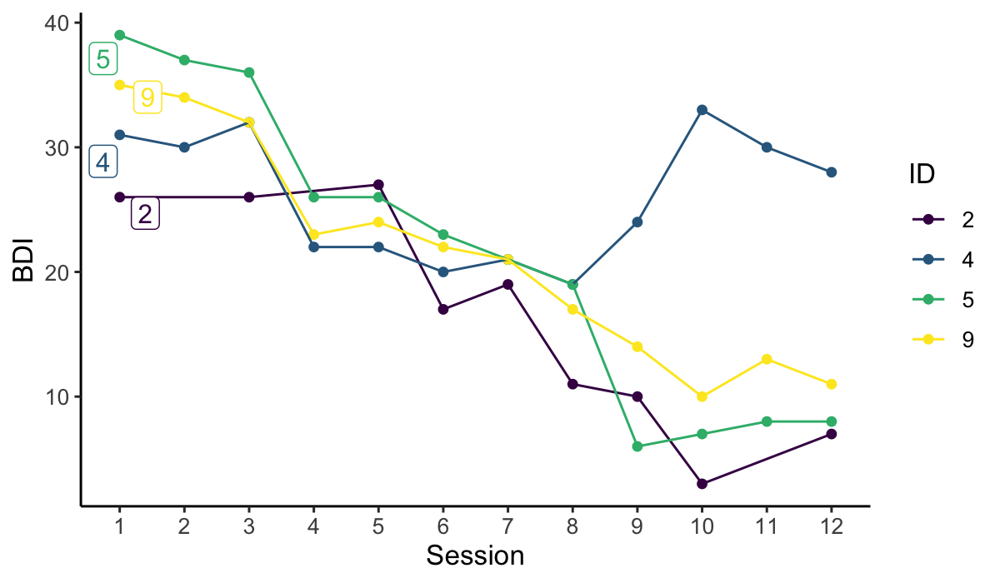

# suddengains: Identify Sudden Gains in Longitudinal Data

Sudden gains are large and stable improvements in an outcome variable
between consecutive measurements, for example during a psychological
intervention with multiple assessments (Tang and DeRubeis,
[1999](https://pubmed.ncbi.nlm.nih.gov/10596511/)). The R package
`suddengains` provides a set of tools to facilitate sudden gains
research. It identifies sudden gains or sudden losses while allowing to
apply adaptations of the standard criteria. It handles multiple gains by
creating two datasets, one structured by sudden gains and one by
participants. It also implements a function to specify which sudden
gains to choose in case of multiple gains (e.g. the earliest or largest
gain).

An interactive web application
**[`shinygains`](https://milanwiedemann.shinyapps.io/shinygains/)**
illustrates the main functions of this package and allows users to
explore and understand the impact of different methodological choices.

To learn more about the background of this package see our paper in
[PLOS ONE](https://pubmed.ncbi.nlm.nih.gov/32150589/). We have also
created an open [Zotero
group](https://www.zotero.org/groups/2280342/suddengains/) collecting
all the literature looking at sudden gains in psychological therapies.
Please let me know if I missed anything or join the group and add papers
yourself.

## Installation

You can install the released version of suddengains from
[CRAN](https://CRAN.R-project.org/) with:

``` r
install.packages("suddengains")
```

And the development version from [GitHub](https://github.com/) with:

``` r
# install.packages("devtools")
devtools::install_github("milanwiedemann/suddengains")
```

## Overview of the functions

The `suddengains` package comes with a range of features which can be
categorised into:

- **Identify sudden gains**:
  - [`select_cases()`](https://milanwiedemann.github.io/suddengains/reference/select_cases.md):
    Select sample providing enough data to identify sudden gains
  - [`define_crit1_cutoff()`](https://milanwiedemann.github.io/suddengains/reference/define_crit1_cutoff.md):
    Uses RCI formula to determine a cut-off value for criterion 1
  - [`identify_sg()`](https://milanwiedemann.github.io/suddengains/reference/identify_sg.md):
    Identifies sudden gains
  - [`identify_sl()`](https://milanwiedemann.github.io/suddengains/reference/identify_sl.md):
    Identifies sudden losses
  - [`check_interval()`](https://milanwiedemann.github.io/suddengains/reference/check_interval.md):
    Checks if a given interval is a sudden gain/loss
- **Create datasets for further analysis**:
  - [`extract_values()`](https://milanwiedemann.github.io/suddengains/reference/extract_values.md):
    Extracts values on a secondary measure around the sudden gain/loss
  - [`create_bysg()`](https://milanwiedemann.github.io/suddengains/reference/create_bysg.md):
    Creates a dataset with one row for each person
  - [`create_byperson()`](https://milanwiedemann.github.io/suddengains/reference/create_byperson.md):
    Creates a dataset with one row for each sudden gain/loss
  - [`write_bysg()`](https://milanwiedemann.github.io/suddengains/reference/write_bysg.md):
    Exports CSV, SPSS, Excel, or STATA files of the sudden gains data
    sets
  - [`write_byperson()`](https://milanwiedemann.github.io/suddengains/reference/write_byperson.md):
    Exports CSV, SPSS, Excel, or STATA files of the sudden gains data
    sets
- **Visualise and report sudden gains**:
  - [`count_intervals()`](https://milanwiedemann.github.io/suddengains/reference/count_intervals.md):
    Count number of between-session intervals available to identify
    sudden gains
  - [`plot_sg()`](https://milanwiedemann.github.io/suddengains/reference/plot_sg.md):
    Creates plots of the average sudden gain
  - [`plot_sg_trajectories()`](https://milanwiedemann.github.io/suddengains/reference/plot_sg_trajectories.md):
    Creates plots of plots of individual case trajectories
  - [`plot_sg_intervals()`](https://milanwiedemann.github.io/suddengains/reference/plot_sg_intervals.md):
    Plot summary of available data per time point and analysed session
    to session intervals
  - [`describe_sg()`](https://milanwiedemann.github.io/suddengains/reference/describe_sg.md):
    Shows descriptives for the sudden gains datasets
- **Helper functions**:
  - [`select_cases()`](https://milanwiedemann.github.io/suddengains/reference/select_cases.md):
    Select sample providing enough data to identify sudden gains
  - [`define_crit1_cutoff()`](https://milanwiedemann.github.io/suddengains/reference/define_crit1_cutoff.md):
    Define cut-off value for first SG criterion
  - [`rename_sg_vars()`](https://milanwiedemann.github.io/suddengains/reference/rename_sg_vars.md):
    Rename variable names to a generic and consistent format

A detailed illustration of all functions can be found in the vignette on
[CRAN](https://CRAN.R-project.org/package=suddengains/). Note that the
vignette is only available in R when you install the package from CRAN.

## How to use `suddengains`

Here are a few examples how to use the `suddengains` package.

``` r
# Load the package
library(suddengains)
#> 
#> ── This is suddengains 0.7.0 ───────────────────────────────────────────────────
#> ℹ Please report any issues or ideas at:
#> ℹ https://github.com/milanwiedemann/suddengains/issues
#> 
```

Below are some examples illustrating the suddengains package. More
details can be found in the
[Vignette](https://CRAN.R-project.org/package=suddengains/vignettes/suddengains-tutorial.html)
or in our [PLOS
ONE](https://journals.plos.org/plosone/article?id=10.1371/journal.pone.0230276)
paper.

### Identify sudden gains

To identify sudden gains/losses you can use the
**[`identify_sg()`](https://milanwiedemann.github.io/suddengains/reference/identify_sg.md)**
and
**[`identify_sl()`](https://milanwiedemann.github.io/suddengains/reference/identify_sl.md)**
functions. These functions return a data frame with new variables
indicating for each between-session interval whether a sudden gain/loss
was identified. For example the variable `sg_2to3` holds information
whether a sudden gains occurred from session two to three, with two
being the pregain and three being the postgain session. Further
functions to help with identifying sudden gains are listed above.

``` r
identify_sg(data = sgdata,
            sg_crit1_cutoff = 7,
            sg_crit2_pct = 0.25,
            sg_crit3 = TRUE,
            id_var_name = "id",
            sg_var_list = c("bdi_s1", "bdi_s2", "bdi_s3", "bdi_s4", 
                            "bdi_s5", "bdi_s6", "bdi_s7", "bdi_s8", 
                            "bdi_s9", "bdi_s10", "bdi_s11", "bdi_s12"),
            identify_sg_1to2 = FALSE)
```

### Create datasets for further analysis

As participants may experience more than one gain, as in the present
example, and to allow for different subsequent analyses, the package
provides two options for output datasets: The
**[`create_bysg()`](https://milanwiedemann.github.io/suddengains/reference/create_bysg.md)**
function creates a dataset structured with one row per sudden gain, and
the
**[`create_byperson()`](https://milanwiedemann.github.io/suddengains/reference/create_byperson.md)**
function creates a dataset structured with one row per person,
indicating whether or not they experienced a sudden gain. The
**[`create_bysg()`](https://milanwiedemann.github.io/suddengains/reference/create_bysg.md)**
function is shown below. More functions to help with creating datasets
for further analyses are listed above.

``` r
# Create output dataset with one row per sudden gain
# and save as an object called "bysg" to use later
bysg <- create_bysg(data = sgdata,
                    sg_crit1_cutoff = 7,
                    id_var_name = "id",
                    tx_start_var_name = "bdi_s1",
                    tx_end_var_name = "bdi_s12",
                    sg_var_list = c("bdi_s1", "bdi_s2", "bdi_s3", "bdi_s4", 
                                    "bdi_s5", "bdi_s6", "bdi_s7", "bdi_s8", 
                                    "bdi_s9", "bdi_s10", "bdi_s11", "bdi_s12"),
                    sg_measure_name = "bdi",
                    identify = "sg")
#> First, second, and third sudden gains criteria were applied.
#> The critical value for the third criterion was adjusted for missingness.
```

### Visualise and report sudden gains

The
**[`plot_sg()`](https://milanwiedemann.github.io/suddengains/reference/plot_sg.md)**
function plots the ‘average’ sudden gain, and can be used to show
changes around the sudden gain. The
**[`plot_sg_trajectories()`](https://milanwiedemann.github.io/suddengains/reference/plot_sg_trajectories.md)**
can be used to visualise trajectories for a selection of individual
cases.

``` r
# Create plot of average change in depression symptoms (BDI) around the gain
plot_sg(data = bysg,
        id_var_name = "id",
        tx_start_var_name = "bdi_s1",
        tx_end_var_name = "bdi_s12",
        sg_pre_post_var_list = c("sg_bdi_2n", "sg_bdi_1n", "sg_bdi_n",
                                 "sg_bdi_n1", "sg_bdi_n2", "sg_bdi_n3"),
        ylab = "BDI", xlab = "Session",
        colour_single = "#239b89ff")
#> Warning: Removed 27 rows containing non-finite values (`stat_summary()`).
#> Removed 27 rows containing non-finite values (`stat_summary()`).
#> Warning: Removed 14 rows containing non-finite values (`stat_summary()`).
#> Warning: Removed 8 rows containing non-finite values (`stat_summary()`).
#> Warning: Removed 10 rows containing non-finite values (`stat_summary()`).
```



``` r
# Visualise trajectories for a selection of individual cases
plot_sg_trajectories(data = sgdata,
                     id_var = "id",
                     select_id_list = c("2", "4", "5", "9"),
                     var_list = c("bdi_s1", "bdi_s2", "bdi_s3", "bdi_s4", 
                                  "bdi_s5", "bdi_s6", "bdi_s7", "bdi_s8", 
                                  "bdi_s9", "bdi_s10", "bdi_s11", "bdi_s12"),
                     show_id = TRUE,
                     id_label_size = 4,
                     label.padding = .2,
                     show_legend = TRUE,
                     colour = "viridis",
                     viridis_option = "D",
                     viridis_begin = 0,
                     viridis_end = 1,
                     connect_missing = TRUE,
                     scale_x_num = TRUE,
                     scale_x_num_start = 1,
                     apaish = TRUE,
                     xlab = "Session", 
                     ylab = "BDI")
#> Warning: Removed 3 rows containing missing values (`geom_point()`).
#> Warning: Removed 3 rows containing missing values (`geom_label_repel()`).
```


